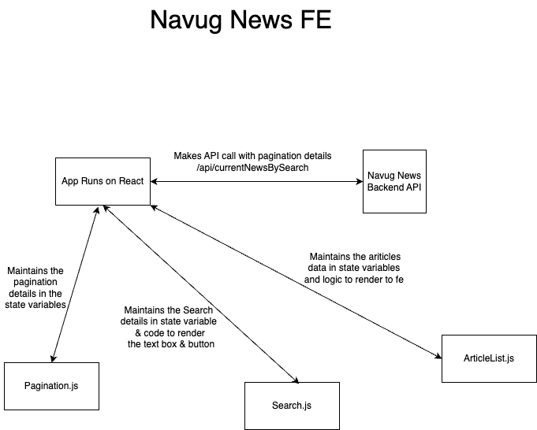

**Embedding the Architecture Diagram**:

To provide a visual representation of your microservice's architecture:

1. **Added the Image**:

   - Place your architecture diagram (e.g., `architecture_diagram.png`) in the `assets` directory of your repository.

2. **Reference in `README.md`**:

   - Use the following syntax to embed the image:

     ```markdown
     
     ```

   - Ensure the path is accurate relative to your `README.md` file.

